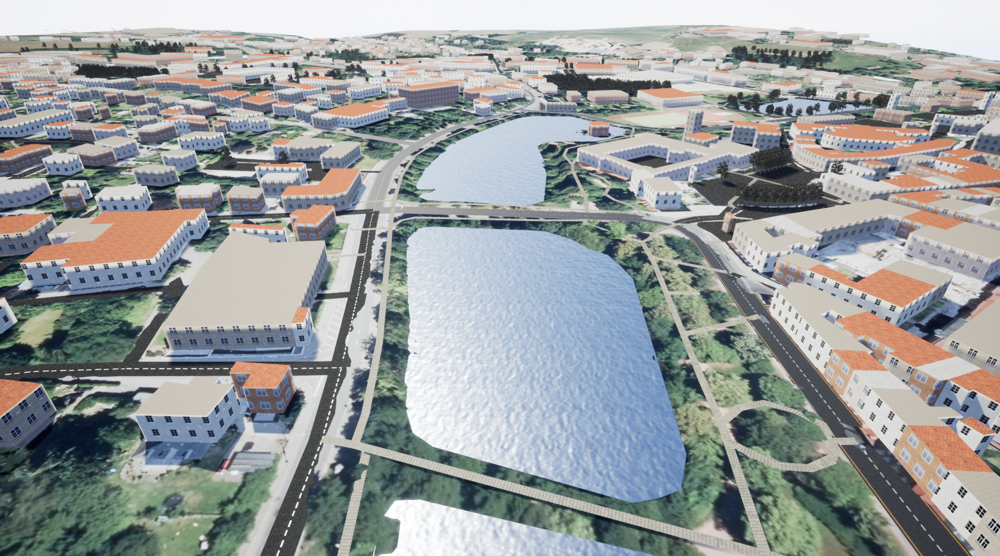
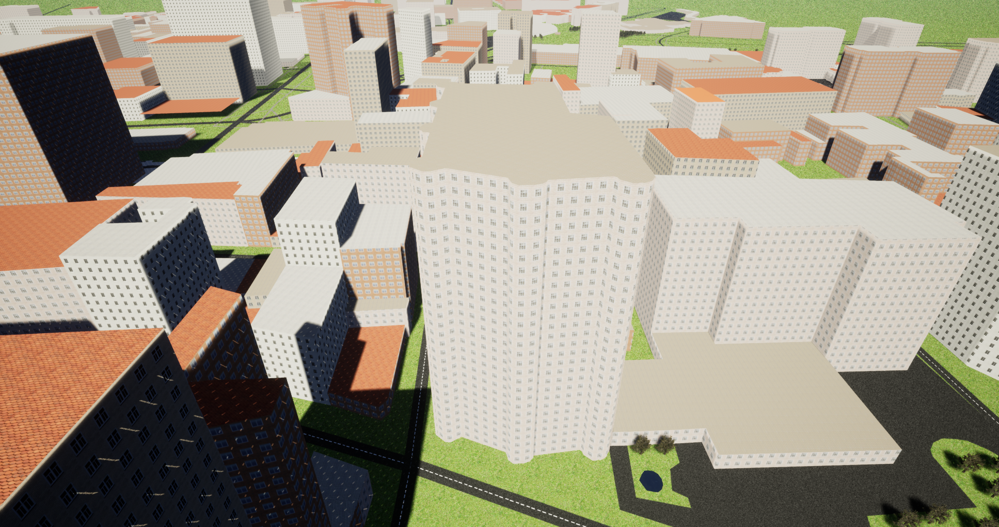
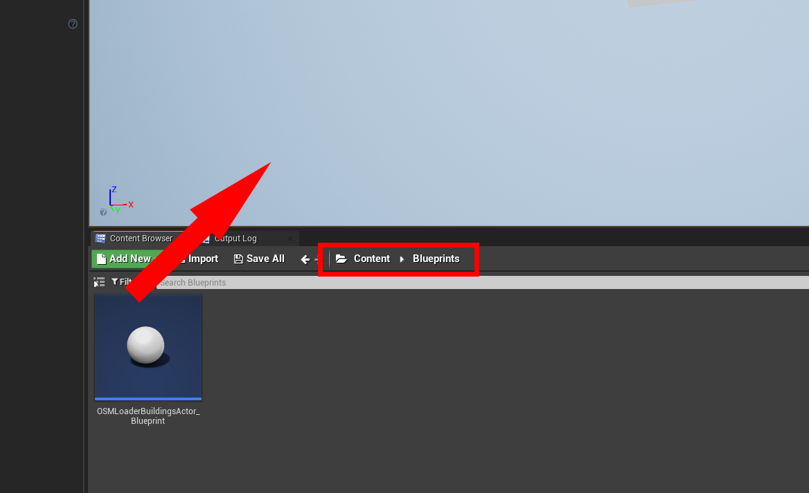
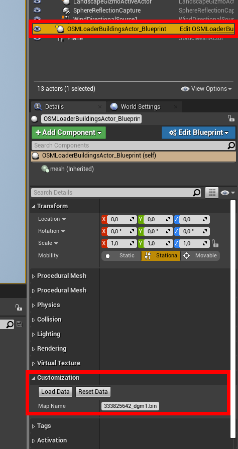

# Unreal OSM

This project was developed for the project seminar "Virtual Reality" at TU Bergakademie Freiberg in winter semester 2019/2020. It's goal is to automatically generate a 3D visualization of freely available data from the [OpenStreetMaps project](https://wiki.osmfoundation.org/wiki/Main_Page) and [government institutions](https://www.geodaten.sachsen.de/).

## Examples

### Freiberg



### New York




## Cloning
After cloning the project you need to perfom the following steps to get all needed files from Git LFS:

```
git lfs install
git lfs pull
```

## Usage
Then build the project in Visual Studio or the Unreal Editor to get everything you need. To get started drag the `OSMLoaderBuildingsActor_Blueprint` inside your scene. 



In the configuration panel you can set the file name of the map. It has to be located inside the `/Content/Data/` folder of the UnrealOSM project. Load the map by pressing the `Load Data` button. After the progress bar disppeared, it can take some time until the map is displayed becuase Unreal has to deal with thounsands of actors.




If you want to delete the map, just click on `Reset Data`.

## Changing the file schema

If you need to adjust the schema of the binary file format, don't forget to place the new generated header file in `/Plugins/OSMLoader/Source/OSMLoader/Public/`.


## About

Developed with Unreal Engine 4.24. 

Authors: Lorenzo Neumann & Johannes Vater.